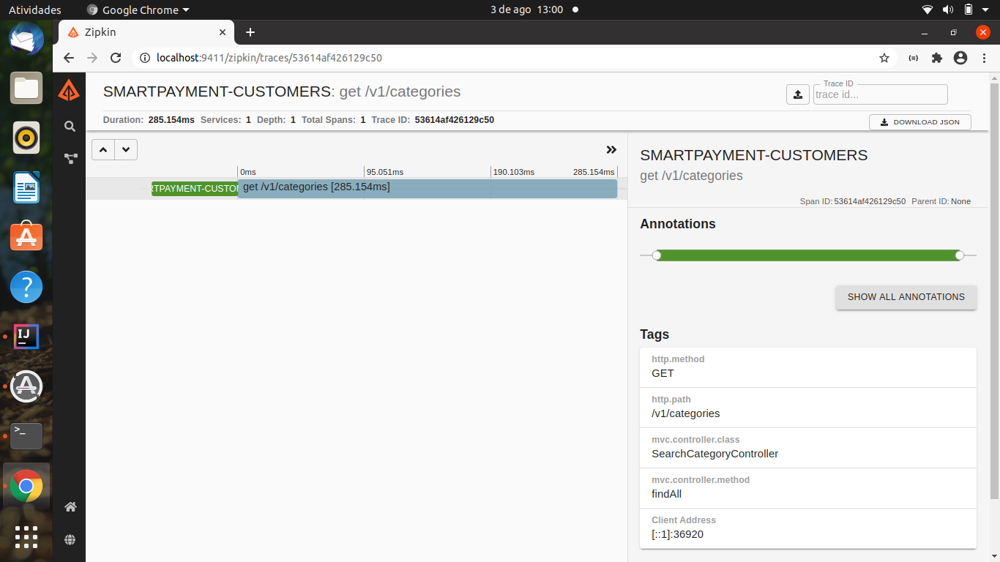
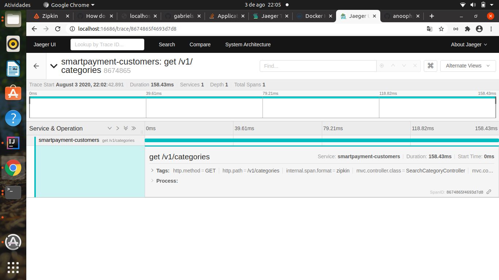

# Example Implementation of a Hexagonal Architecture

### How to Run

1. Run the following command

`
docker-compose up --build
`

2 . Send a request 

`
curl -d '{"description":"GOLD"}' -H "Content-Type: application/json" -X POST localhost:8080/v1/categories
`

3. Open the Jaeger Console: http://localhost:16686/

### Other Projects

* [SmartPayment Orders](https://github.com/gabrielsmartins/smartpayment-orders)
* [SmartPayment Payments](https://github.com/gabrielsmartins/smartpayment-payments)
* [SmartPayment Account](https://github.com/gabrielsmartins/smartpayment-account)
* [SmartPayment Credit Card](https://github.com/gabrielsmartins/smartpayment-credit-card)

### References

[Spring Cloud Sleuth Using Zipkin and Jaeger](https://github.com/anoophp777/spring-webflux-jaegar-log4j2)

### Demonstration

#### Using Zipkin

#### Using Jaeger

